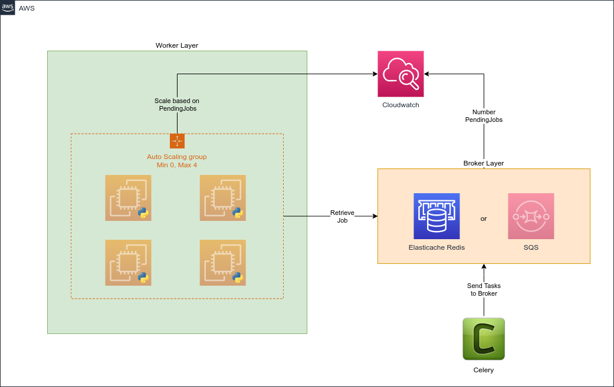

# BMAT - Back Office DevOps test

## Introduction

This Terraform deploys a solution based on Redis as a broker and EC2 instances as workers, following the instructions as closely as possible.

I have also included an additional solution in this same Terraform, which allows the user to deploy an alternative solution based on SQS, which offers some advantadges over Redis.

SQS is highly-available and scalable in nature, is supported by Celery as well and already provides some metrics that could be used to handle scaling rather than depending on a custom metric.

More details on how to deploy this alternative solution can be found in the **Alternative Solution** section.

## Architecture diagram



## Instructions

### Profile

In order to run the code, Terraform 0.13 is required and you need to pass an AWS profile configured in your credentials file (`~/.aws/credentials`) where the solution will be deployed.

Example of the profile configuration in `~/.aws/credentials`:

```
[bmat]
aws_access_key_id = YOUR_ACCESS_KEY
aws_secret_access_key = YOUR_SECRET_ACCESS_KEY
```


The profile can be passed in two different ways:

#### Interactive
```
terraform init
```

```
terraform plan
terraform apply

var.aws_profile
  AWS profile name (in your credentials file) that you want to use to deploy the solution

  Enter a value: bmat
```

#### Pre-defined
In [variables.tf](./prod/eu-west-1/variables.tf) file, define it as a default value:
```
variable "aws_profile" {
    description = "AWS profile name (in your credentials file) that you want to use to deploy the solution"
    default = "bmat"
}
```

### Key Pair
You need to provide a Key Pair for the instances. By default, this Terraform is configured to use a Key Pair called `aws_bmat_prod` and will fail if it does not exist. 

You may change the name to use any other keypair you have in that account by changing the `key_pair` value inside `general` variable in `variables.tf`.

### Creating new environments

Creating new environments is as simple as duplicating the contents of the *prod* folder to *preprod*, for example, and then changing the `variables.tf` file.

The only module that should be checked for potential changes is the securitygroups module, since Security Groups can often be environment-specific and hence it is not included as a global module, but inside the corresponding environment.

Given more time, I would have created a standard module for securitygroups, so that they can be defined dynamically from `variables.tf`.

## Scaling

As the test mentions, I assumed that the number of pending jobs can be found in a Cloudwatch metric, called PendingJobs in the BMAT namespace.

In order to simulate the scaling operations, you can use the aws cli and the put-metric-data command:

```
aws cloudwatch put-metric-data --metric-name PendingJobs --namespace BMAT --value 5 --dimensions QueueName=prod-bmat --region eu-west-1 --profile bmat
```

In case you want to simulate a real-world scenario of an Application writing to this custom metric at a periodic interval, you can use the following command and play with the value to achieve the desired results (`value > 4` to scale-up or `value <= 0` to scale-down):

```
watch -n 60 aws cloudwatch put-metric-data --metric-name PendingJobs --namespace BMAT --value 5 --dimensions QueueName=prod-bmat --region eu-west-1 --profile bmat
```

#### Considerations

For this exercise, the scale-up period has been reduced to 60s for faster demostration, and the scale-down period to 120s.

This ensures we scale-down slower than we scale-up, which helps avoid an excessive number of instance terminations and recreations.

In a real-world scenario these values should be adjusted according to the time instances need to bootstrap and become available for work, and how quickly we need to scale-up when new Jobs come in. The starting point for these values could be a scale-up period of 300s and a scale-down period of 600s, and then adjust these values until the desired results are achieved.

## Availability

Elasticache Redis has been configured with 2 nodes to ensure High Availability of the broker layer. 

Workers, on the other hand, have deliberately not been configured in High Availability so that they can be scaled down to 0 as required and gradually scaled as needed. Normally a worker layer doesn't require HA since if something happens the job can be processed again and, in fact, if occasional interruptions are acceptable, it would be more cost-effective to use spot instances rather than standard instances for this Worker layer.

## Alternative Solution

In order to enable the alternative solution based on SQS, you only need to switch the value of the variable `broker` from `Redis` to `SQS`:

```
variable "broker" {
  description = "Defines the broker to use between Redis and SQS"
  default     = "Redis"
}
```

to:

```
variable "broker" {
  description = "Defines the broker to use between Redis and SQS"
  default     = "SQS"
}
```

This will result in the Redis resources being disabled, and SQS being enabled. Some variables related to the autoscaling metrics used to scale will automatically be switched as well.

All this is handled through count conditions in the corresponding modules and conditionals in some variables.

In order to test this alternative solution, you may add messages to the created SQS queue either via AWS Console or the CLI until the thresholds are met (`>4` to trigger scale-up) and delete them completely from the queue to trigger scale-down.